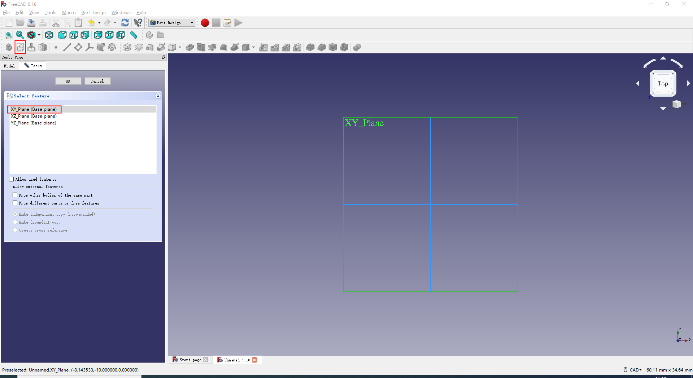
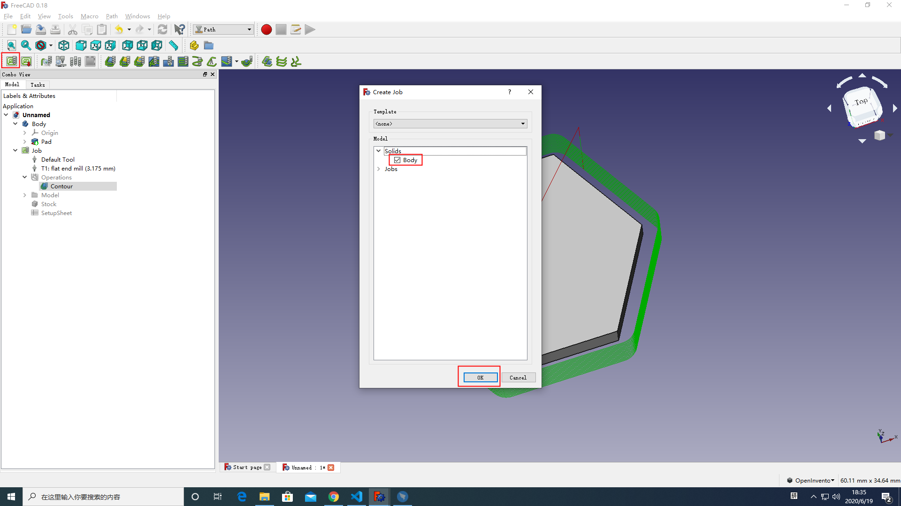
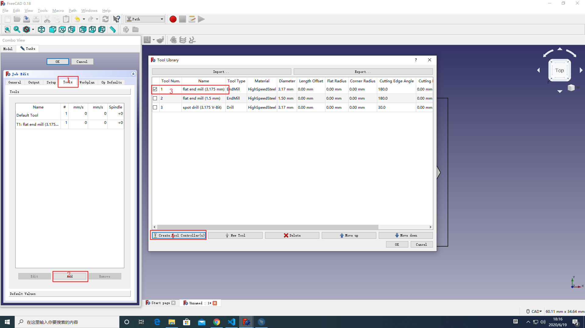
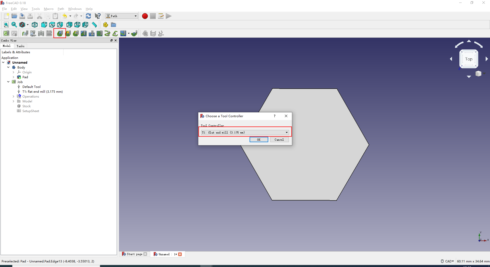

Generate G-code Using FreeCAD
===============
This instruction teaches you how to carve hexagons on a 2mm carbon fiber sheet. Once you are familiar with all the settings, you can design your own invention. For more details, please visit https://wiki.freecadweb.org/User_hub

## Getting Started

This software is available for Windows and Mac. Since the configuration for both systems is similar, here in this instruction, we take steps in Windows as an example.

### Step 1. Get the Software Ready

Install the software and save the configuration files according to the following steps:

1. Download and Install FreeCAD at https://www.freecadweb.org/.
2. Select the **Path workbenches** and click **tool manager** to import the [Snapmaker-2.0-CNC-Tools(FreeCAD).json](./Snapmaker-2.0-CNC-Tools(FreeCAD).json).
3. Copy [snapmaker_freecad_post.py](./snapmaker_freecad_post.py) to the C:\Program Files\\${FreeCAD Path}\Mod\Path\PathScripts\post to add the post processor of the Snapmaker to FreeCAD.
    - More FreeCAD path post details on the https://wiki.freecadweb.org/Path_Post

### Step 2. Design the Model You Want to Carve

1. In FreeCAD, select **Part Design** as the Workbenches.
2. Create a new sketch and select the XY_Plane(Base plane).

3. First set the navigation style to CAD, and click  to create a regular polygon.When you finish editing, click   to close the editing of the sketch.

4. Click  and enter 2.00 mm in the Length field. Click OK.

### Step 3. Generate Tool-Path Strategies
1. Change the Workbenches to **Path**.
2. Click ,Selected body and Click OK.
 
    - Select **Output** and set Processor is snapmaker_freecad. 
       
    - Select **Tools** and click Add.Selected the **flat end mill (3.175 mm)** and click **Create Tool Controllers(s)** to add the tools.
    
    - Click OK.
3. Click  to create a contour and set the flat end mill tool.
    - Set the Step Down to 0.2mm
 
    - Click OK.
### Step 4. Generate G-code
1. Selected the **Job -> Operations -> Contour** and click  to post process.

2. Change the G-code name as you need, and save the G-code.

