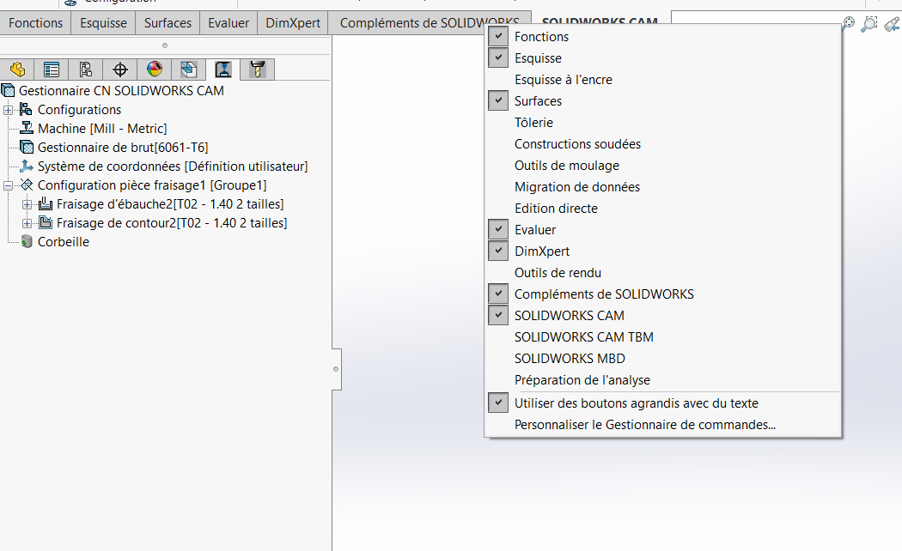
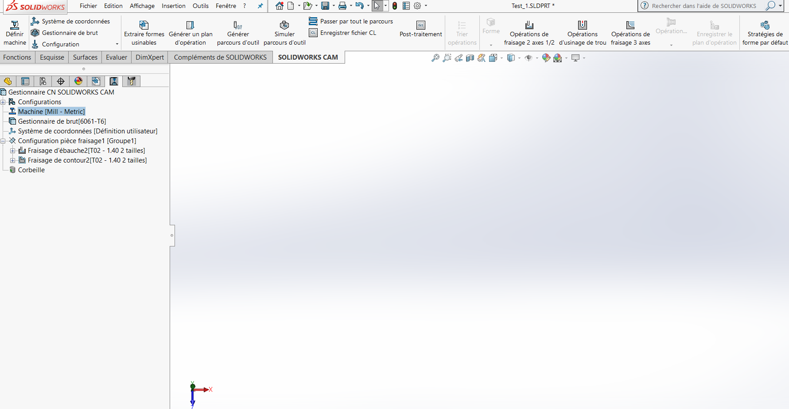
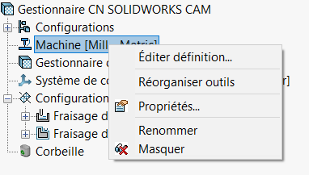
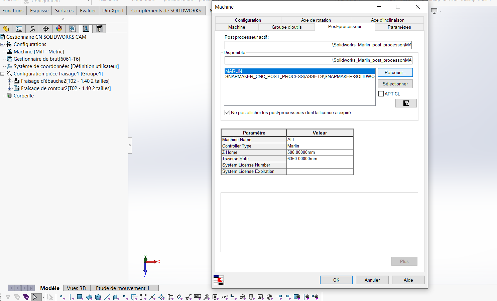
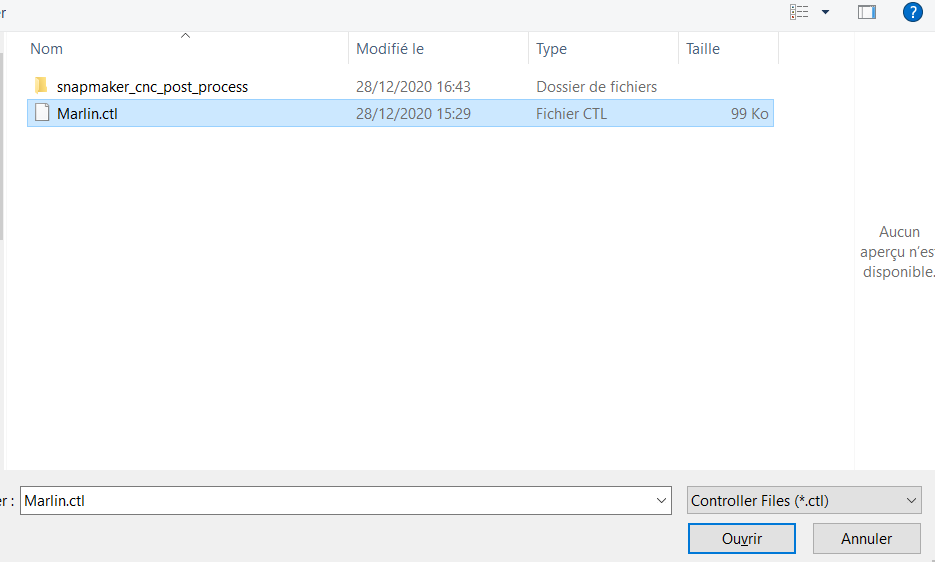
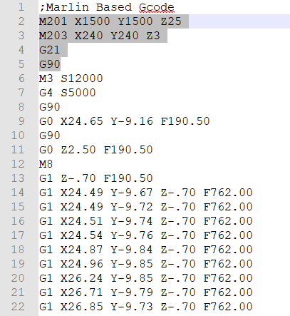
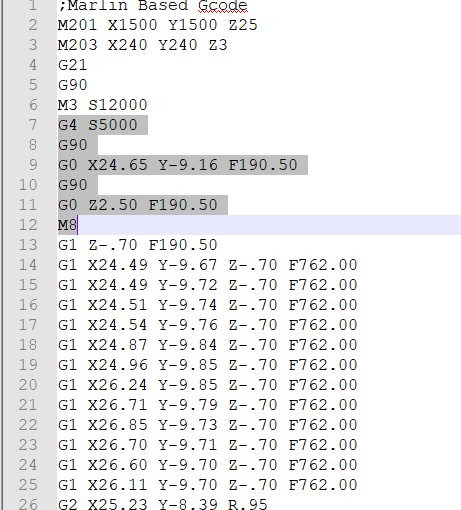
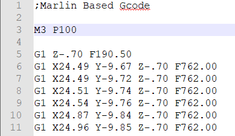

# Informations :

This folder contains the **.CTL** file to load a Marlin compatible (hence Snapmaker compatible as it is based on Marlin flavored GCode) postprocessor on Solidworks CAM.

This ressource was originally found here :

https://www.thingiverse.com/thing:4097176

All credits to DarkAlchemist, licensed under cc-nc-sa.

# Usage :

To install, in solidworks CAM :

1. Launch solidworks and go to **SolidworksCAM tab** 

   In case you don't see it, try to see if it is available by right-clicking the tab region under the main top-ribbon, and check if SolidworksCAM is present and not checked. If so, check it. ( It however still may not be available depending on your licence options )

2. Select the CNC solidworks gestion tab in the left-pannel :

3. Right click on **Machine**, and select **"Edit definition" :**

4. In the **pop-up window**, select the **post-processing tab**, and select **Browse** to choose the **.ctl** file you downloaded :

5. Choose the Marlin.ctl file you downloaded. Click open, and then click "select" in the Machine configuration previous  Window.

It is now done for the installation.

When you export your .cnc programs off of SolidworksCAM, you just need to open them with any text based editor (like Notepad++). There is only two steps here : 

remove the top parts in grey on the images below : (Gcode  unreadable by Snapmaker in CNC mode based on their docs) :

and change M3 line with S12000 parameter to M3 line with P100 parameter ([Explanation of M3 command usage by snapmaker firmware](https://github.com/Snapmaker/snapmaker_cnc_post_process/blob/master/gcode_reference.md#m3))

The .cnc files will then be loadable in Snapmaker Luban or SnapmakerJS and executeable by the Snapmaker controller.

(sucessfully tested on a snapmaker 2.0 A250 with firmware V1.10.1)

No issues on "run boundary" function noticed.

