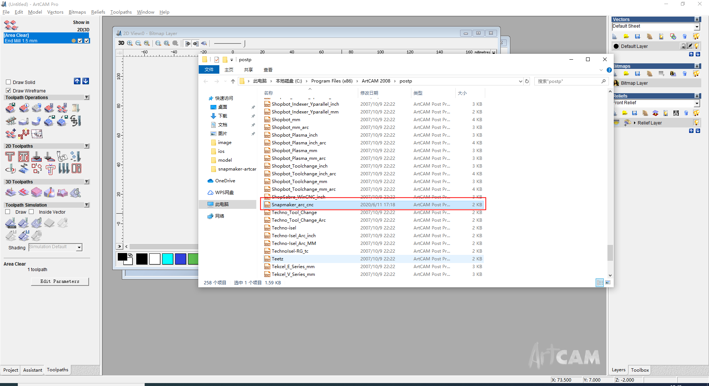
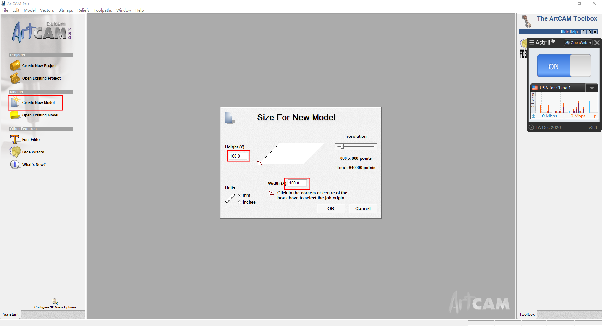
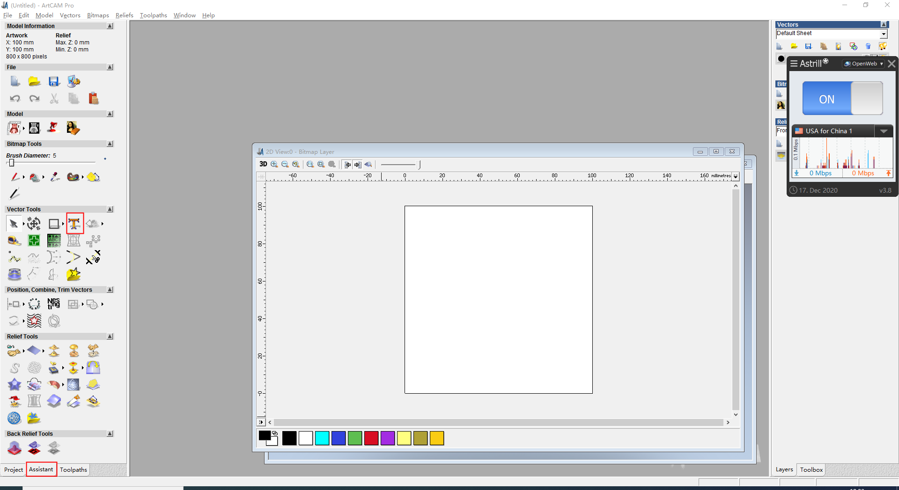
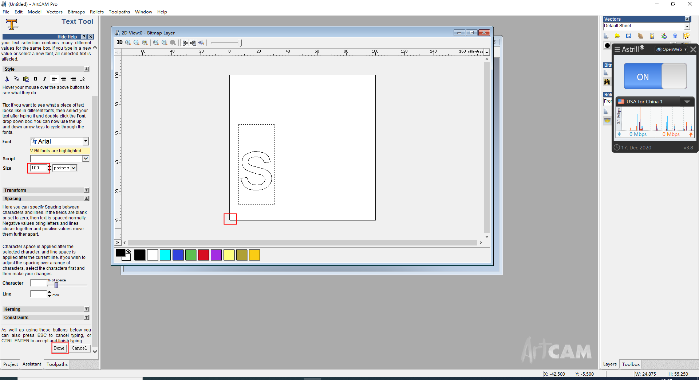
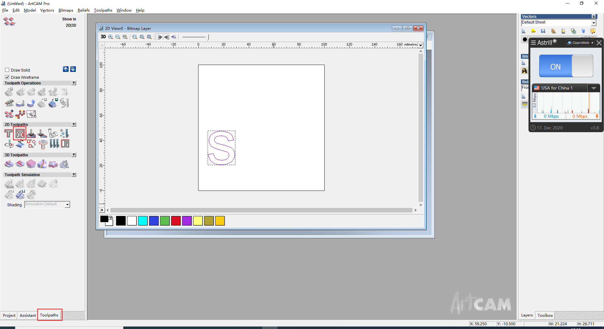
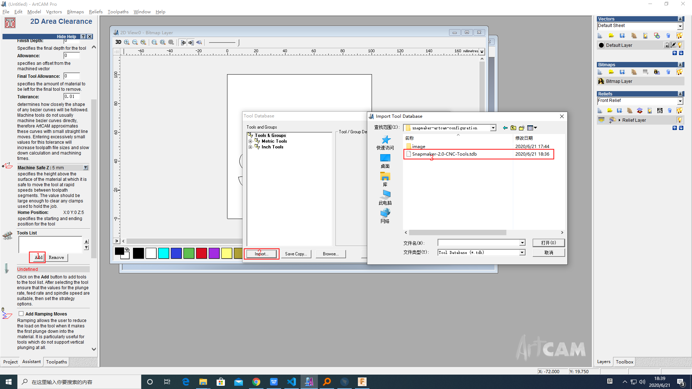
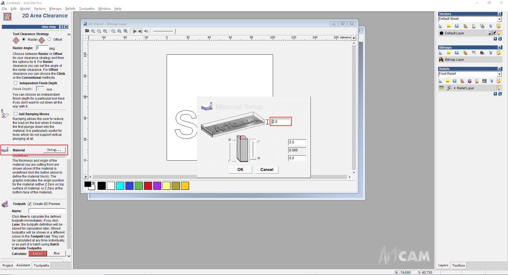
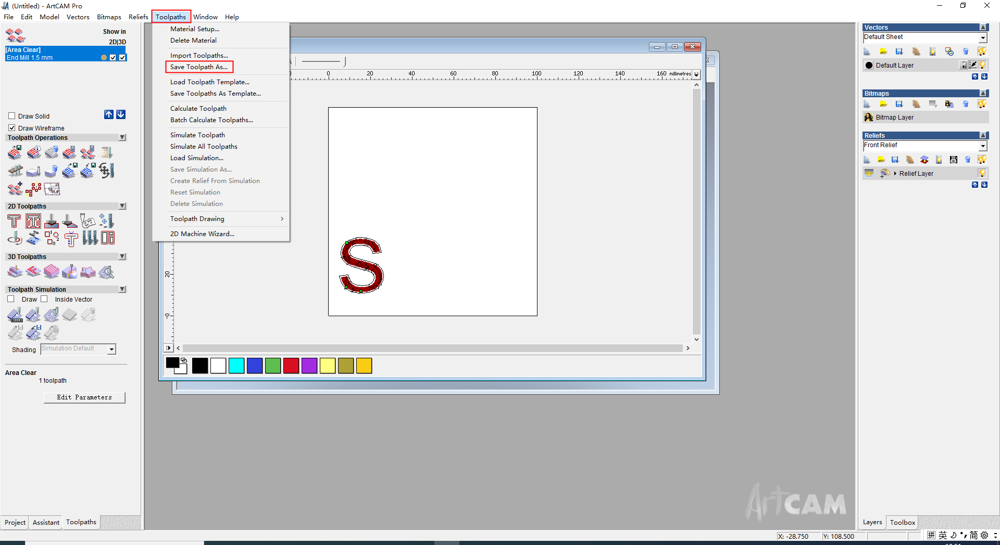
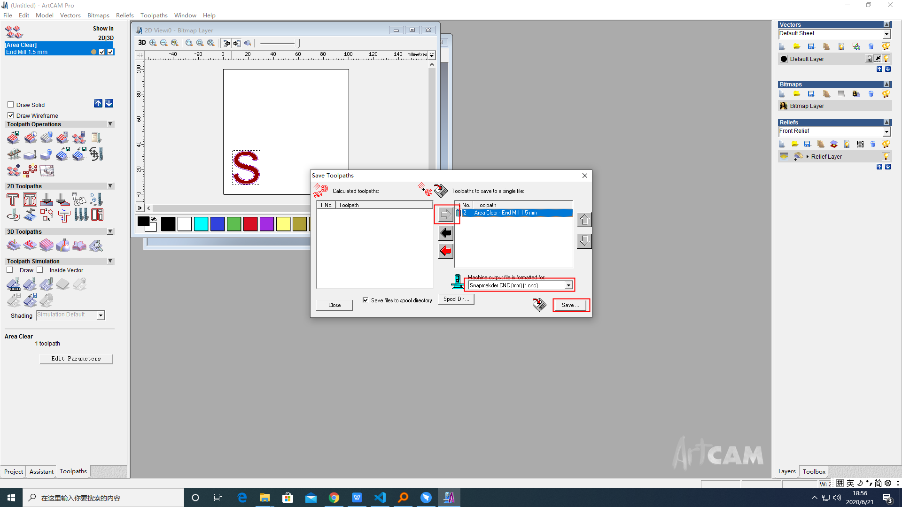

Generate G-code Using ArtCAM
===============
This instruction teaches you how to carve an “S” on a 2mm carbon fiber sheet. Once you are familiar with all the settings, you can design your own invention. 

## Getting Started

This software is available for Windows and Mac. Since the configuration for both systems is similar, here in this instruction, we take steps in Windows as an example.

### Step 1. Get the post-processer configuration Ready

1. Download the post-processing configuration on our website https://snapmaker.com/download/snapmaker2.
2. Copy [Snapmaker_arc_cnc.con](./Snapmaker_arc_cnc.con) to the C:\Program Files (x86)\${ArtCAM}\postp. Restart the ArtCAM.

### Step 2. Design the Model You Want to Carve

1. Create a new model with a width and height of 100mm.

2. Select the assistant in the left toolbar and create a vector text with "s".

3. Set the size. The (0, 0) coordinate is in the lower left corner.Click Done.

### Step 3. Generate Tool-Path Strategies

1.  Select the Toolpaths in the left toolbar and Click **the 2D Toolpaths > Area Clearance**.

    1. Add Tools List. Import [Snapmaker-2.0-CNC-Tools.tdb](./Snapmaker-2.0-CNC-Tools.tdb) to ArtCAM and select **Snapmaker Tools > End Mill 1.5mm**.
    
    2. Set the material to 2.0 mm.
    
    3. Select the model and Calculate now.
    4. Close.
2. Copy [Snapmaker_arc_cnc.con](./Snapmaker_arc_cnc.con) to the C:\Program Files (x86)\${ArtCAM}\postp
    1. Select **Toolpaths > Save Toolpath As**.
    
    2. Select the **Snapmaker CNC (mm)** as the Machine format output file.
    
    3. Change the G-code name as you need, and save the G-code.

